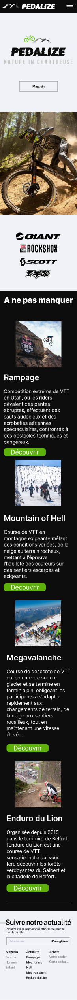

# Équipe Team Chartreuse - Projet BUT Informatique Pedalize - 02/09/2023 17/10/2023

 
## Informations Équipe
- **Membres** :
  - COLIN Cédric
  - LEVIN Marvyn
  - DULIEUX Baptiste
  - MEYER Timothée

## Technologies Utilisées
- **Langages de Programmation** : 
  - HTML5, CSS3 (Responsive), JavaScript, SQL (MariaDB), Rust (API)

## Présentation du Projet
Développement d’un site responsive en HTML, CSS et Rust pour l’entreprise fictive Pedalize, dans le cadre d’un projet demandé universitaire, sur une durée d’un mois.




## Instructions d'Exécution sur Windows

### Étapes d'Installation

1. **Installer MariaDB :**  
   Téléchargez MariaDB depuis le site officiel : [MariaDB Download](https://mariadb.org/download/)

2. **Installer Rust :**  
   Suivez les instructions sur le site officiel pour installer Rust : [Get Started with Rust](https://www.rust-lang.org/learn/get-started)

### Configuration de la Base de Données

Ouvrez une nouvelle fenêtre MariaDB 11.5 (x64) et exécutez les commandes suivantes :
```shell
# Créer un utilisateur
mysql -u root -p
CREATE USER 'identifiant'@'localhost' IDENTIFIED BY 'votre_mot_de_passe';
GRANT ALL PRIVILEGES ON *.* TO 'identifiant'@'localhost' WITH GRANT OPTION;
FLUSH PRIVILEGES;

# Créer la base de données
mysql -u identifiant -p
CREATE DATABASE pedalize;
SHOW DATABASES;
USE pedalize;
```

### Exécution des Scripts SQL

N'oubliez pas d'exécuter les scripts SQL situés dans le répertoire `\api\db`.

### Lancement de l'API

Ouvrez une nouvelle fenêtre PowerShell et exécutez les commandes suivantes :
```shell
rustc --version
cargo --version

cd \Desktop\pedalize\api\build
cargo build --release

cd ..\target\release

Set-Content -Path "database_config.json" -Value @"
{
    "username": "identifiant",
    "password": "votre_mot_de_passe",
    "database": "pedalize",
    "host": "localhost",
    "port": 3306
}
"@
Get-Content -Path "database_config.json"

cargo run
```

### API Lancée
Lorsque l’API est lancée, vous devriez voir des messages similaires à ceux-ci :
```shell
Finished `dev` profile [unoptimized + debuginfo] target(s) in 0.43s
 Running `C:\Users\X\X\pedalize\api\target\debug\api.exe`
2024-11-02T00:55:15.371487Z  INFO api: Starting...
2024-11-02T00:55:15.392272Z  INFO App: Running on 0.0.0.0:9999
```
